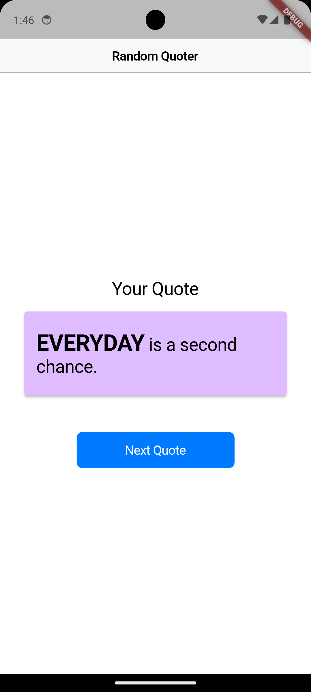

# Random Quoter

Random Quotes Generator App to Get to Know about Flutter with Cupertino Apps

## APIs Used

- [Zen Quotes](https://zenquotes.io/)

## Screenshot

## Flutter Helpers

- [Material Theme Guide](https://m3.material.io/)
- [Google Icons](https://fonts.google.com/icons?icon.platform=flutter&sort=popularity&icon.style=Filled)
- [Cupertino Colours](https://api.flutter.dev/flutter/cupertino/CupertinoColors-class.html)
- [Flutter Gallery](https://gallery.flutter.dev/#/)
- [Flutter Cookbook](https://docs.flutter.dev/cookbook)
- [Flutter Dev Learn](https://flutter.dev/learn)
